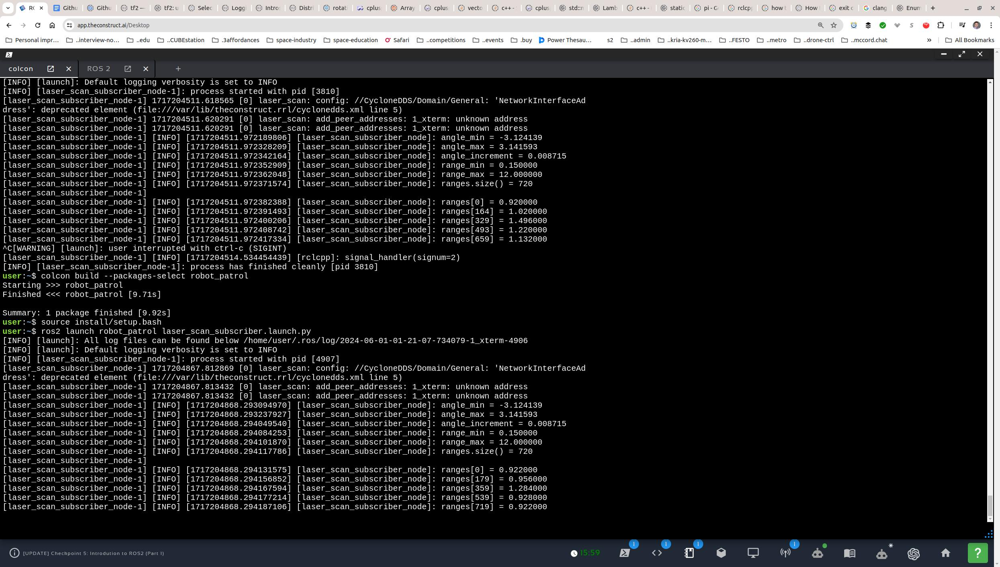
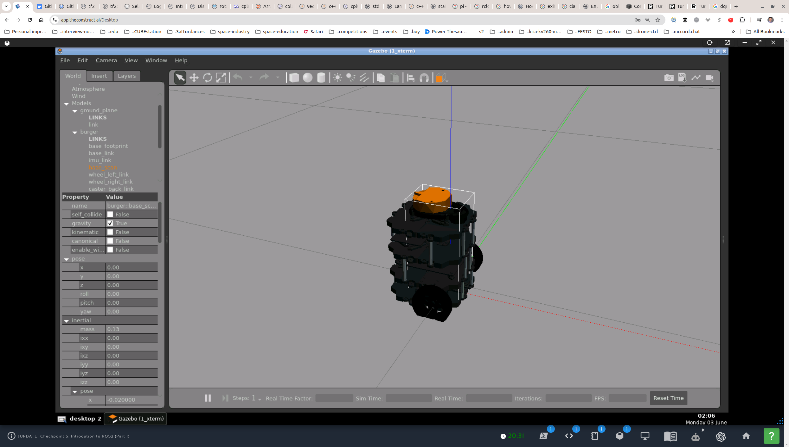
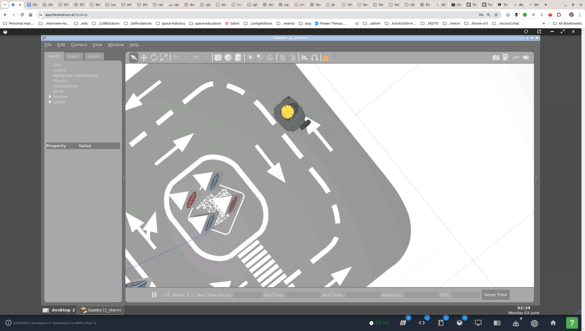
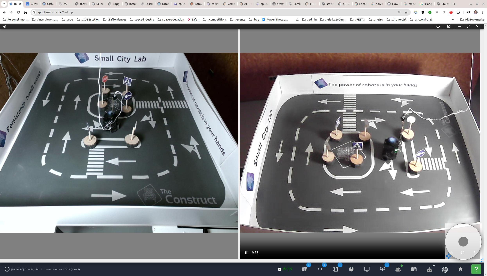

### robot_patrol

A turtlebot3 patrolling the simulated and real robot pen/polygon. Patrolling means _constantly moving and avoiding obstacles_.

#### Submission notes

`colcon build --packages-select robot_patrol`  
`ros2 launch turtlebot3_gazebo main_turtlebot3_lab.launch.xml`  
`ros2 launch robot_patrol start_patrolling.launch.py`

1. 

#### Laser scan orientation and parameterization

##### Simulator

```
[laser_scan_subscriber_node]: angle_min = -3.141600
[laser_scan_subscriber_node]: angle_max = 3.141600
[laser_scan_subscriber_node]: angle_increment = 0.009534
[laser_scan_subscriber_node]: range_min = 0.120000
[laser_scan_subscriber_node]: range_max = 30.000000
[laser_scan_subscriber_node]: ranges.size() = 660

[laser_scan_subscriber_node]: ranges[0] = 1.610980
[laser_scan_subscriber_node]: ranges[164] = 1.600037
[laser_scan_subscriber_node]: ranges[329] = 0.226959
[laser_scan_subscriber_node]: ranges[493] = 0.470259
[laser_scan_subscriber_node]: ranges[659] = 1.572943
```

```
    /**
        This shows that the turtlebot3 laser scan is parameterized thus:
                 329
              _________
            |||   ^   |||
            |||  fwd  |||
        493   |l     r|   164
              |       |
              |___b___|
                  0 (659)
        These are the indices of the ranges array:
        329 - forward (also approximately 359)
        493 - left
          0 - backward
        164 - right
    */
```


##### Lab

  


#### Current yaw

1. The current yaw of the robot is extracted from the odometry message:
   ```c++
   yaw_ = yaw_from_quaternion(
       msg->pose.pose.orientation.x, 
       msg->pose.pose.orientation.y, 
       msg->pose.pose.orientation.z,
       msg->pose.pose.orientation.w);`
2. Using the formula, this works fine in the Gazebo simulator:
   `atan2(2.0f * (w * z + x * y), w * w + x * x - y * y - z * z);`
3. The values are +/- pi radians, equivalent to +/- 180 degrees.

#### Scanner orientation

In short, **angle zero** being "forward along the x-axis" doesn't mean that **index zero** of the `ranges` vector coincides. It is actually diametrically opposite.

1. In `tutrlebot3_burger.urdf`, there is no rotation in the joints between `base_footprint` and `base_link`, nor between `base_link` and `scan_base`.
2. In `empty_world.launch.py`, the robot appears in default pose with the forward direction along the x-axis. The LIDAR is therefore aligned the same way.
     
3. In the simulator, I positioned the robot in such a way that it was unambiguous which index was 0, and it was the exact opposite of what `ros2 interface show sensor_msgs/msg/LaserScan` states (below). My index 0 is _backward_ (not _forward_) along the x-axis.
   
   Readings:
   ```  
   angle_min = -3.141600
   angle_max = 3.141600
   angle_increment = 0.009534
   range_min = 0.120000
   range_max = 30.000000
   ranges.size() = 660

   ranges[0] = 0.498451
   ranges[164] = 1.056713
   ranges[329] = 0.195327
   ranges[494] = 0.789187
   ranges[659] = 0.485331
   ```
4. `ros2 interface show sensor_msgs/msg/LaserScan` reads:
   ```
   std_msgs/Header header # timestamp in the header is the acquisition time of
        builtin_interfaces/Time stamp
                int32 sec
                uint32 nanosec
        string frame_id
                             # the first ray in the scan.
                             #
                             # in frame frame_id, angles are measured around
                             # the positive Z axis (counterclockwise, if Z is up)
                             # with zero angle being forward along the x axis

   float32 angle_min            # start angle of the scan [rad]
   float32 angle_max            # end angle of the scan [rad]
   float32 angle_increment      # angular distance between measurements [rad]

   float32 time_increment       # time between measurements [seconds] - if your scanner
                                # is moving, this will be used in interpolating position
                                # of 3d points
   float32 scan_time            # time between scans [seconds]

   float32 range_min            # minimum range value [m]
   float32 range_max            # maximum range value [m]

   float32[] ranges             # range data [m]
                                # (Note: values < range_min or > range_max should be discarded)
   float32[] intensities        # intensity data [device-specific units].  If your
                                # device does not provide intensities, please leave
                                # the array empty.
   ```

#### Implementation notes

  
The actual TurtleBot3 lab.  

1. The hardest spots for the robot, where it tens to either start oscillating or (if the oscillation is actually only in the code) get stuck, are:
   1. Corners.
   2. Corner-like spots with traffic-sign obstacles.
   3. Finding itself too close (around or under `min_range`) to an obstacle.

2. Remediation measures:
   1. Direction safety (like convex-fitting) (default/fixed).
   2. **Bias** (optional):
      1. Larger angles.
      2. Larger ranges.
   3. Randomize (optional):
      1. Direction (left, right).
   4. **Extend** (optional):
      1. New direction span (from +/- pi to under +/- 2 * pi). 
   5. **Back up** (move backward) (optional);

3. Detecting problematic cases:
   1. Oscillation: count calls to `find_safest_direction` with no significant `x, y` movement.
   2. Too close and stuck: count `inf` values in the range `[FRONT_FROM, FRONT_TO]`.
   3. New directions too close to current orientation: within tolerance of current orientation.

4. `SOS` state that would relax the requirements and allow the robot to extricate itself when it detects that it is stuck. Some of the parameters to relax:
   1. Angle to look for new directions > +/- pi. Add `extended = false` parameter to `find_safest_direction`. _Watch for wraparound. May need to normalize at the edges._
   2. Slow backward movement (`cmd_vel_msg_.linear.x = -0.05;`) with close 360-degree monitoring of obstacles.  
   3. Note that if the robot is somehow stuck too close to an obstacle, it might be closes than `range_min` and therefore show `inf` values!  

5. (_advanced_) Add buffer space around obstacles to avoid the wheels catching the bases of the traffic signs. See lab camera views above.
   1. Measure arc-width of the detected obstacles.  
   2. Calculate the if one of the wheels might catch the obstacle.
   3. Modify the direction of the robot to avoid the obstacle.  
   4. Do this dynamically throughout as obstacle widths will vary depending on the (changing) orientation relative to the robot (point of view).  
   5. This will require the dimensions of the robot.

6. Multithreading protection.
   1. `laser_scan_data_` or `last_laser_scan_data_`.


#### State machine

##### New classes and vars

1. Setup
   1. `stuck_threshold_` (x,y-space) ~0.10 _CONSIDER!!!_
   2. `too_many_turns_threshold_` ~5
2. Track
   1. `last_state_` takes care of all the cases where state logic depends on the previous state, specifically in `State::STOPPED` when arriving from `State::TURNING` and `State::BACK_UP`.
   2. `turns_` (after completing a turn)
      1. set after completing a turn in `State::TURNING`
      2. unset in `State::STOPPED` when starting forward linear
3. Report
   1. `is_oscillating_`
      1. set in `State::STOPPED` _What is the purpose?_ _CONSIDER!!!_
      2. unset ???
   2. `too_close_to_obstacle_`
      1. set in `State::STOPPED`
      2. unset ???

##### States

`enum class State { STOPPED, FORWARD, FIND_NEW_DIR, TURNING, BACK_UP };`

1. STOPPED
   0. check for anomalies
      1. check for oscillating, i.e. turning not moving away from an obstacle (i.e. still obstacle in front)
      2. check if too close in `std::tuple<bool, float>` from `obstacle_in_range`
   1. if anomalies => BACK_UP, FIND_NEW_DIR (extended=true, bias=ANGLE)
   2. if no anomalies, no obstacle => FORWARD
   3. if no anomalies, yes obstacle => FIND_NEW_DIR (extended=false)
   4. if obstacle, just turned and 6 turns => `is_oscillating_ = true;`, `BACK_UP`
   5. if no obstacle and `just_backed_up_` => set `extended_range_ = true;` and `FIND_NEW_DIR`
2. FORWARD
   1. if obstacle => FIND_NEW_DIR (extended=false)
3. FIND_NEW_DIR
   1. if `extended_range_`, do extended
   2. set `extended_range_ = false;`
   3. done => TURNING
4. TURNING
   1. done => STOPPED
   2. `++turns_;`
   3. set `just_turned_ = true;`
5. BACK_UP
   1. back up slowly until no obstacle in FRONT spread
   2. closely monitor obstacles in BACK
   3. `too_many_turns_threshold_` should be even, so as to back up in a direction that is less likely to be problematic 
   2. set `just_backed_up_ = true;` => STOPPED


##### TODO

1. ~`find_safest_direction`~
   1. ~bias angle or range (in tuple vector for "safety" sorting)~
      1. `enum class DirSafetyBias { ANGLE, RANGE };`
      2. `ANGLE` favors larger angles, `RANGE` favors longer ranges. Bias applied after safety criterion!!!
      3. new function parameter `dir_safety_bias = DirSafetyBias::ANGLE`
      4. defaulting on `DirSafetyBias::RANGE` might work better with safety criterion, with `DirSafetyBias::ANGLE` applied to help getting unstuck.
   2. ~direction bias~
      1. `enum class DirPref { RIGHT, LEFT, RIGHT_LEFT, NONE };`
      2. `NONE` returns the index of the safest dir `v_indexed_averages[0]`, `LEFT_RIGHT` is based on the count of directions to the left and right.
      3. new function parameter `dir_bias = DirPref::NONE`
   3. deep review of the core "safety" criterion and strength of biases
2. ~oscillation~ 
   1. ESSENCE: `just_turned_` and there is an obstacle (in `STOPPED`)
   2. count in `State::TURNING` calls to `find_safest_direction`
   3. check the angle between the two directions _CONSIDER!!!_
3. ~too close to obstacle (possibly under `range_min`)~
   1. count the `inf` in `obstacle_in_range`
   2. a std::tuple<bool, float> return value for `is_obstacle` and the ratio of `inf` (to all)
   3. check in `State::STOPPED` or `State::FORWARD` _CONSIDER!!!_
   4. set `too_close_to_obstacle_`
4. ~anomalous states~
   1. one `State::SOS` 
      1. pro: catch-all for anomalous situations, a unified strategy for extrication
      2. con: potentially too complex for pass-through
   2. `State::OSCILLATION` AND `State::TOO_CLOSE`
      1. pro: easier for pass-through
      2. con: different strategies might be redunant and/or error-prone
   4. `State::BACK_UP` is best, logic in `State::STOPPED`
5. Buffer angle (indices) for obstacles under the LIDAR plane:
   1. It's important to distinguish between walls (background) and signs (foreground). The idea is to add buffer angles on both sides of the foreground obstacles while leaving the background unchecked. Get ideas from the [ros2-nav2](https://roboticsbackend.com/ros2-nav2-tutorial/) tutorial.
   2. Loop through `ranges` array and identify abrupt drops and jumps in distance. Going CCW from `0` to `RANGES_SIZE`, the first will be a drop and is the right edge, the second is going to be a jump and is the left edge, with the middle being the foreground obstacle.
   3. Add buffer angle to each side, down the indices on the right or the right edge and up the indices to the left of the left edge. In a nested loop, this can be achieved by marking as **obstacle** the buffer-angle-corresponding indices on both sides of each originally identified point of a foreground obstacle, including the edges. The buffer added may depend on the distance, smaller for farther obstacles and larger for nearer obstacles.
   4. The resulting picture of obstacles represents the available ranges. Pick the middle of each span of available ranges as the direction candidate and sort first by width then by distance in descending order.
   5. Pick the top direction.
   6. _Should there be a minimum width to filter by?_
   6. _Should this be done in `obstacle_in_range` or only in `find_safest_direction`?_ 
6. Find how to visualize the scanner in the simulator for `turtlebot3_gazebo`.
   1. Find the launch file `main...`.
   2. Find the launch descriptions referenced there.
   3. Find the files for each package.
   4. Find the `<visualize>` tag in the `model.sdf` file for the `burger` and/or `waffle` bot, probably the former (which is the latest model).
   5. Find the URDF or other file with the original `<visualize>` tag that made it into the SDF file, and change to `true`. _Changing the value in the `model.sdf` file doesn't seem to be picked up._
   6. Rebuild the project(s). Might try to do it the empty world first, if that's going to be easier somehow. 

##### Errors in `find_direction_midrange`

1. A single `F2B_RATIO_THRESHOLD` fails in certain cases.
   ```
    [laser_scan_subscriber_node-1] 264: 1.80827 (0)
    [laser_scan_subscriber_node-1] 265: 1.78352 (0)
    [laser_scan_subscriber_node-1] 266: 1.76106 (0)
    [laser_scan_subscriber_node-1] 267: 1.77472 (1)   <-- caught (off-by-one`)
    [laser_scan_subscriber_node-1] 268: 0.852214 (1)  <-- caught
    [laser_scan_subscriber_node-1] 269: 0.852501 (1)
    [laser_scan_subscriber_node-1] 270: 0.882327 (1)
    [laser_scan_subscriber_node-1] 271: 0.86416 (1)
    [laser_scan_subscriber_node-1] 272: 0.862503 (1)
    [laser_scan_subscriber_node-1] 273: 0.861747 (1)
    [laser_scan_subscriber_node-1] 274: 0.862008 (1)
    [laser_scan_subscriber_node-1] 275: 0.872485 (1)
    [laser_scan_subscriber_node-1] 276: 0.888668 (1)
    [laser_scan_subscriber_node-1] 277: 0.896473 (1)
    [laser_scan_subscriber_node-1] 278: 0.884809 (1) <-- missed
    [laser_scan_subscriber_node-1] 279: 1.64608 (1)  <-- missed
    [laser_scan_subscriber_node-1] 280: 1.62386 (1)
    [laser_scan_subscriber_node-1] 281: 1.61329 (1)
    [laser_scan_subscriber_node-1] 282: 1.62641 (1)
    [laser_scan_subscriber_node-1] 283: 1.60649 (1)
   ```
   1. Tune to the space.
   2. Use window average.
   3. **Switch to difference with a finite value, not a ratio, because the inverse is way too big.**
2. A memory access error occurs at certain times.
   1. Check all container random access.
   2. Check circular array accesses.
3. Clear spans count is off by one.
   1. Check circular array tracking.
   2. Analyze the algorithm for marking obstacles and clear spans.
4. Obstacle marking is off by one.
   1. Analyze where the DROP and RISE are assigned.